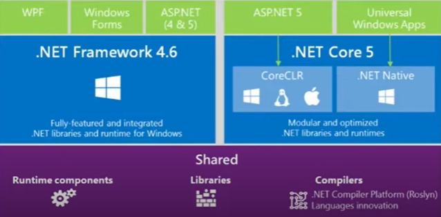
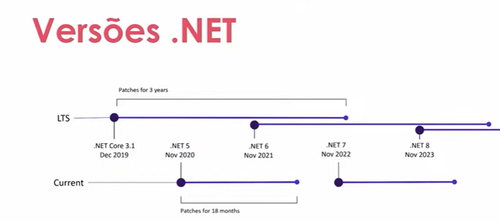
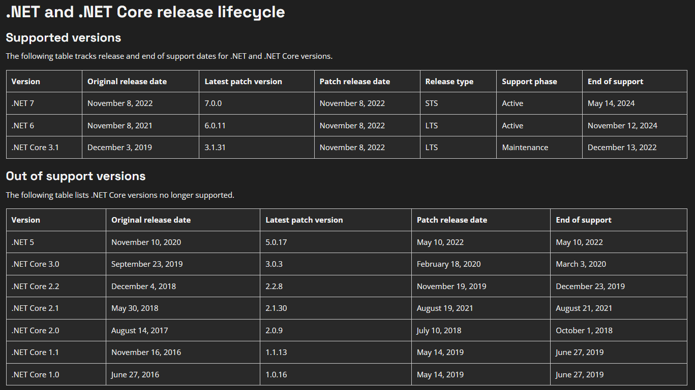

# CSharpOO

## .NET Core 5 em diante é multiplataforma
Fazer uso do CoreCLR ao criar a aplicação

Evolução de Core para somente .NET

Ciclo de Suporte e Atualizações referente a Linguagem Patches 

## Fases do Compilador
[compilador](intro_img/compilador.png)

## Extensões recomendadas 
C#
C# extensions josKreativ - Simplifica criar novas classes, interfaces...
vscode icons vscode icons team - melhora a visualização de pastas e ícones 

## Anotações específicas da máquina minha
Em meu Linux estou rodando a versão 7.0 .NET
Lembrar de alterar ccsharpOOCurso.csproj 
<TargetFramework>net6.0</TargetFramework><!-- 7.0 No Linux ou 6.0 no windows-->

